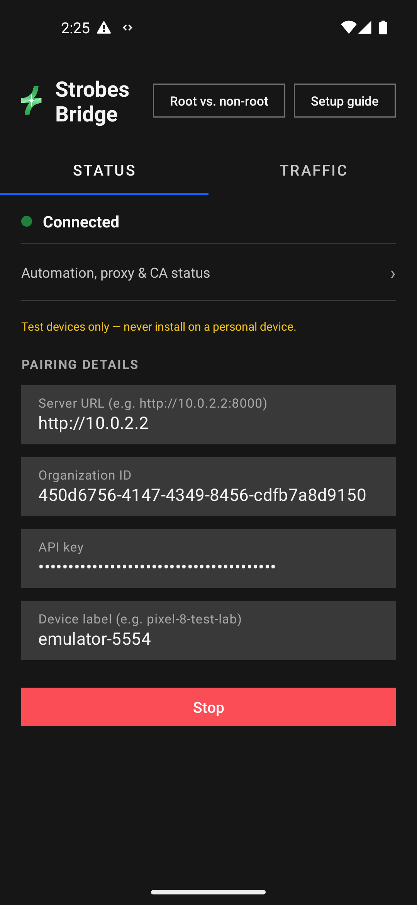

# Strobes Bridge (Android)

A companion Android app that turns a rooted (or plain) test phone/emulator
into a **Test Device** the Strobes platform's AI agents can discover,
reserve, and drive directly for live mobile-app pentesting — instead of
only being able to hand the user a RUNBOOK.md of manual Frida/mitmproxy
steps to run themselves.

It pairs to a Strobes organization over an outbound WebSocket (no inbound
port, no USB/local-adb daemon required) and exposes the same command
protocol the desktop Shell Bridge daemon speaks, so it's a drop-in
alternative transport for `mobile_pentest_agent`'s tools.

> **Test devices only.** This app installs a local MITM proxy and can read
> traffic, SMS, IMEI, and other device data on behalf of a pentest
> engagement. Never install it on a personal device, or one with personal
> accounts, photos, messages, or other sensitive data.



## How it works

1. Install the APK on a device provisioned for testing (see [Releases](../../releases)).
2. Open the app, run through the **Setup guide** (root check → permission
   grants → Accessibility Service, if non-root → CA cert trust).
3. Enter the pairing details — server URL, organization ID, API key, and a
   device label — and tap **Start**.
4. The device registers as a `TestDevice` on the platform and shows up to
   `mobile_pentest_agent` via `list_test_devices`. The agent's first
   `android_*` tool call against it reserves it exclusively for that
   session (see the platform-side [Test Devices feature](https://github.com/strobes-co/strobes/pull/9696)).

## Capabilities

The app auto-detects root at connect time (Magisk / KernelSU / APatch, or a
bare AOSP `su`) and degrades gracefully to a non-root fallback path
(Android's Accessibility Service) rather than failing outright. Reachable
in-app via **Root vs. non-root** on the main screen:

| Capability | Root | Non-root |
|---|---|---|
| Arbitrary shell command | Yes | No |
| Tap / swipe / type | Yes (`input`/shell) | Yes (Accessibility) |
| Screenshot | Yes | Yes (Android 11+) |
| UI hierarchy dump | Yes | Yes (Accessibility) |
| Launch app by package | Yes | Yes (monkey launcher) |
| List installed packages | Yes | Yes (PackageManager) |
| Network info | Yes | Yes (ConnectivityManager) |
| Arbitrary file read/write | Yes (any path) | No (sandboxed `VirtualFs` only) |
| Traffic interception (MITM) | Yes | No — no VPN-based fallback yet |
| CA cert trust | Yes (auto, no dialog) | Yes (KeyChain dialog, user confirms) |
| System-wide CA trust store | Yes (root-manager module + reboot) | No |
| IMEI / phone number / SIM serial | Yes | No (restricted since Android 10) |
| Read SMS | Yes | Yes (`READ_SMS` permission) |
| Device identifiers (Android ID) | Yes | Yes |
| Install / clear / uninstall apps | Yes | No |

On non-root devices, `shell_execute` calls carrying the small set of shell
idioms an agent's `android_*` tools actually send (`input tap/swipe/text`,
`screencap -p`, `uiautomator dump`, `am start`, `monkey -p ... LAUNCHER`,
`pm list packages`) are transparently translated to the Accessibility
Service equivalent — an agent that only speaks `shell_execute` keeps
working unmodified whether or not the device is rooted. Anything with no
non-root equivalent (arbitrary `su`-requiring commands, `pm install`,
IMEI/SMS) returns a clear, honest failure instead of a silent no-op.

### Root broker support

Root capability isn't Magisk-specific: the app tries `libsu` (talks to
whichever root-manager daemon is installed) first, falling back to a bare
`su` invocation compatible with plain AOSP `userdebug`/`eng` builds. The
**system-wide CA trust store** path (staging a `/data/adb/modules/` module,
which needs a reboot to activate) uses the same on-disk convention shared
by **Magisk, KernelSU, and APatch** — whichever one is actually installed.

### Traffic interception (embedded MITM proxy)

- Root: `proxy_start` sets the device's system HTTP proxy and installs the
  bridge's freshly-generated CA into the **live** user cert store — no
  reboot, no manual cert install. Every app that honors the system proxy
  setting is captured automatically.
- Non-root: the same CA can be trusted manually via **KeyChain** (Settings
  → Security → install certificate), walked through step-by-step in the
  Setup guide.
- Captured request/response pairs (headers, bodies, timing, status) are
  readable back over the same WebSocket channel (`proxy_history`) — no
  external mitmproxy/Burp instance required — and are viewable in-app under
  the **Traffic** tab, grouped by host with a drill-down detail view.
- `proxy_install_root_ca` / `proxy_uninstall_root_ca` *stage* (never
  auto-trigger) a root-manager module for system-trust-store CA install —
  the actual reboot is always a local, human-confirmed action in the app's
  own UI, never something a remote command can trigger.
- A patched-APK fallback (`tools/patch_apk.py`) exists for the case where a
  target app itself won't trust a user-installed CA (targets API 24+ with
  no permissive Network Security Config, or ships its own cert pinning) —
  see `tools/README.md`.

### Runtime SSL-pinning bypass (Frida)

A one-time, human-triggered **Enable Frida** toggle in the app's own UI
downloads `frida-inject` matched to the device's real CPU architecture (no
`frida-server` daemon needed — this reuses the same root-shell channel as
every other on-device action). Once enabled:

- `frida_bypass_pinning` injects a prebuilt bundle covering every technique
  from [httptoolkit/frida-interception-and-unpinning](https://github.com/httptoolkit/frida-interception-and-unpinning) —
  native BoringSSL hooking, ~20 named Java pinning libraries (OkHttp,
  TrustKit, Appcelerator, WorkLight, Netty, Cordova, appmattus, etc.), and
  root-detection bypass — into a specific running app, or every running app
  at once.
- `frida_run_script` injects arbitrary on-demand Frida JS for a one-off
  native hook the bundled bypass doesn't cover.
- `frida_read_logs` / `frida_stop_script` / `frida_list_sessions` read a
  session's live console output, actually tear its hooks back down (kills
  the injector process — confirmed to really stop the hooks, not just
  quiet the logging), or list what's still running.
- Injection never happens without a human first tapping **Enable Frida** —
  a remote command can't silently stage a 50MB+ binary on someone's device.

### Structured device inspection

Parsed JSON wrappers over what could otherwise only be done via raw shell
text-scraping: installed packages, network interfaces/routes/DNS, logcat
(filterable by package), device identifiers (IMEI/phone/serial/Android ID),
and SMS read (filterable by sender address — the primary use case being
automating an SMS-OTP login flow).

### File transfer

`file_read` / `file_write` / `file_list` / `file_upload` / `file_download`
— lets an agent push an APK's bytes and `pm install` it, or pull back
binary UI-automation artifacts (screenshot PNGs, UI-dump XML) without the
UTF-8 mangling a shell stdout capture would cause.

## Non-root fallback in depth

When no root broker is present, enabling the **Strobes Accessibility
Service** (Settings → Accessibility → Strobes Bridge) unlocks tap, swipe,
type-into-focused-field, screenshot (Android 11+), UI dump, and
launch-by-package/component — everything else (arbitrary shell, IMEI/SMS,
install/clear apps, system-wide traffic interception) has no substitute and
fails with an explicit error rather than a silent no-op.

## Setup guide (in-app wizard)

Walks through, in order: the test-device-only warning → root check → (if
non-root) permission grants for the high-value non-root capabilities →
enabling the Accessibility Service → trusting the proxy's CA (one-tap as
root; download-then-install-via-Settings on non-root) → a summary of what's
now available.

## Permissions

`INTERNET`, `ACCESS_NETWORK_STATE`, `FOREGROUND_SERVICE` (+
`FOREGROUND_SERVICE_SPECIAL_USE`), `POST_NOTIFICATIONS`, `WAKE_LOCK`,
`RECEIVE_BOOT_COMPLETED`, `QUERY_ALL_PACKAGES`, `READ_PHONE_STATE`,
`READ_SMS` / `RECEIVE_SMS`, `READ_MEDIA_IMAGES` / `READ_MEDIA_VIDEO` /
`READ_MEDIA_AUDIO`, `READ_EXTERNAL_STORAGE` / `WRITE_EXTERNAL_STORAGE`,
`ACCESS_FINE_LOCATION` / `ACCESS_COARSE_LOCATION`.

## Protocol

Speaks the same protocol as `strobes_shell_agent/client.py` (the desktop
Shell Bridge daemon) so the platform side treats this as a drop-in
alternative transport — same Shell model, same REST endpoints, same
`shell_execute`/`file_*`/`env_info` command set — plus Android-specific
commands layered on top: `list_packages`, `network_info`, `logcat`,
`device_identifiers`, `read_sms`, `proxy_*`, `frida_*`. Not implemented:
PTY sessions (`pty_open` returns a graceful "not supported" instead of
hanging) and background shell jobs (`shell_bg_*`) — long UI-automation
flows are instead driven as a sequence of ordinary `shell_execute` calls.

## Building & releasing

Standard Gradle project (`applicationId = co.strobes.bridge`, `minSdk 26`,
`targetSdk 34`).

```bash
./gradlew assembleDebug
```

The [Release APK workflow](.github/workflows/release.yml) builds a debug
APK and publishes it as a GitHub Release on manual trigger:

```bash
gh workflow run release.yml --repo strobes-co/strobes-android-bridge
```

## Related

- Backend Test Devices feature: [strobes-co/strobes#9696](https://github.com/strobes-co/strobes/pull/9696)
- Frontend Test Devices settings page: [strobes-co/strobes-fe#13298](https://github.com/strobes-co/strobes-fe/pull/13298)
- Tracking issue: [strobes-co/strobes#9695](https://github.com/strobes-co/strobes/issues/9695)
- APK cert-trust patching tool (non-root fallback): [`tools/README.md`](tools/README.md)
